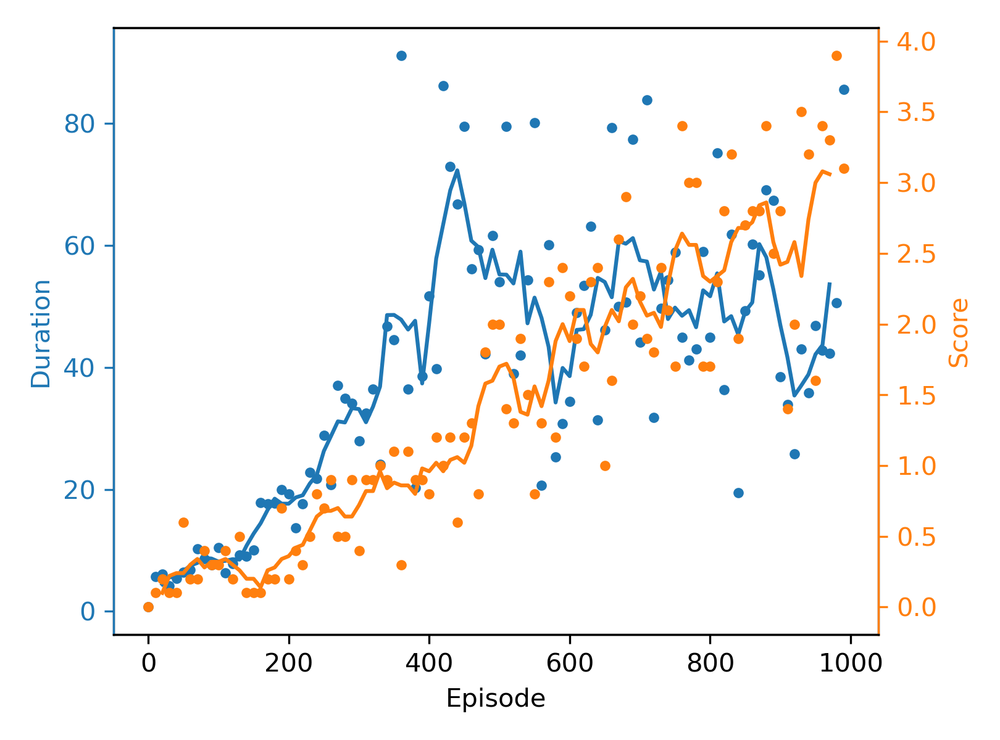

# The project

This is a basic snake game played by an AI trained by reinforcement learning.
# Introduction

## Game environment

Straight forward snake game. It is playable in a pygame window by running "snakeGame-playable.py". It can generate maps of desired dimensions. You can go through the walls and pop out on the other sides, and if you try to go backward it makes you go forward as a punishment. 

## Reinforcement learning

While being playable, the game environment is structured with reinforcement learning in mind, returning the state of the game and the reward for each move, like in the gym environment. I designed my game environment being inspired by the gym, using it as a guideline of functions/returns are required to make a good environment for reinforcement learning.

# Results

# RL ressources

* Haykin, Neural Networks and Learning Machines (3rd Ed), Chap. 12: Dynamic Programming
* Pytorch DQN tutorial, https://pytorch.org/tutorials/intermediate/reinforcement_q_learning.html
* Learning to play snake at 1 million PS,Oscar Knagg, https://towardsdatascience.com/learning-to-play-snake-at-1-million-fps-4aae8d36d2f1
